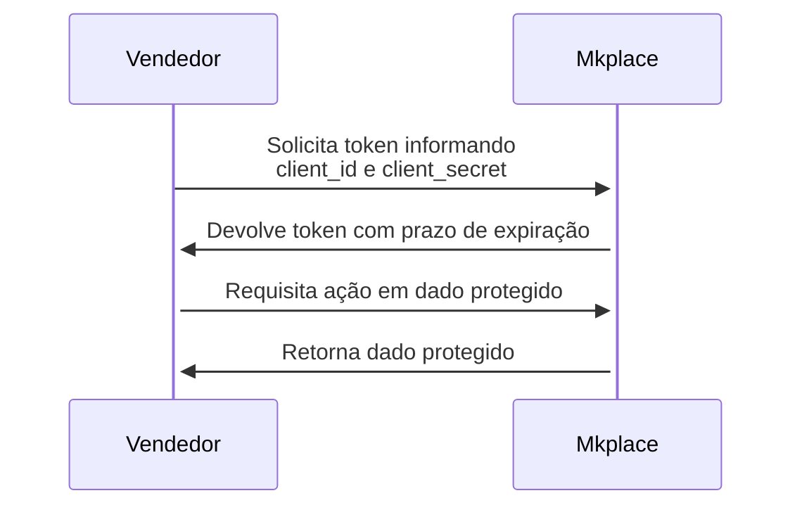

Antes de iniciar a implementação da autenticação, o vendedor precisa possuir suas chaves de acesso (`client_id` e `client_secret`), que devem ser solicitadas ao administrador do marketplace após a finalização do setup, pelo canal de suporte ([suporte@mkplace.com.br](mailto:suporte@mkplace.com.br)).

<Warning>
  As chaves de acesso em **produção** serão fornecidas ao final da integração em homologação.
</Warning>

## Gerando token 🪪

Usamos o padrão `OAuth2`. Após o cadastro do vendedor e com as chaves em mãos, devolvemos um token de acesso em formato JWT que deve estar no cabeçalho de todas as requisições aos nossos serviços.

- [O que é um token JWT?](https://www.devmedia.com.br/como-o-jwt-funciona/40265)
- [O que é o padrão OAuth 2.0?](https://www.treinaweb.com.br/blog/o-que-e-oauth-2)

Fluxo:



Para requisitar um token, faça um `POST` no endpoint de token do Keycloak. O contrato completo, com os campos e respostas, está em [Gerar token](/api-reference/auth/gerar-token).

```bash
curl --request POST \
  --url https://idp.mkplace.com.br/realms/{realm}/protocol/openid-connect/token \
  --header 'Content-Type: application/x-www-form-urlencoded' \
  --data grant_type=client_credentials \
  --data client_id=<seu_client_id> \
  --data client_secret=<seu_client_secret>
```

O `realm`, o `client_id` e o `client_secret` são fornecidos pela Mkplace. O `access_token` retornado deve ser enviado no header `Authorization: Bearer <access_token>` em todas as requisições.