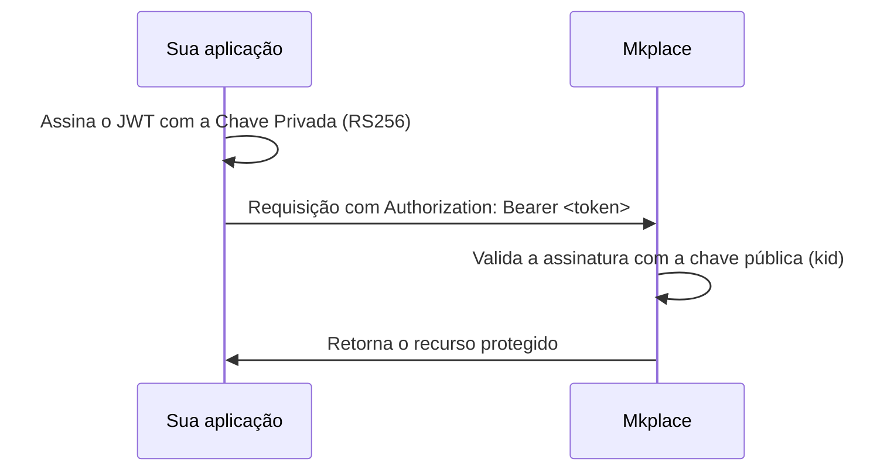

A integração usa autenticação por **JWT (JSON Web Token)** assinado com o algoritmo assimétrico **RS256**. A sua aplicação **assina** o token com a Chave Privada fornecida pela Mkplace, e a Mkplace **valida** a assinatura com a chave pública correspondente, identificada pelo `kid`.



<Info>
  A Chave Privada e o `kid` são **fornecidos individualmente pela Mkplace** durante o onboarding. A sua aplicação nunca gera esses valores — em caso de dúvida ou ausência das credenciais, acione o time de suporte ([suporte@mkplace.com.br](mailto:suporte@mkplace.com.br)).
</Info>

O token deve ser enviado no cabeçalho HTTP de **todas as requisições autenticadas**:

```http
Authorization: Bearer <token>
```

## Estrutura do token

Um JWT é uma string composta por três partes separadas por ponto — `header.payload.signature` (`xxxxx.yyyyy.zzzzz`). Cada parte tem um papel:

<Tabs>
  <Tab title="Header">
    Indica o tipo de token, o algoritmo de assinatura e o `kid` que identifica a chave pública correspondente na Mkplace.

    ```json
    {
      "alg": "RS256",
      "typ": "JWT",
      "kid": "<RS256 Key ID>"
    }
    ```

    <Note>
      O `kid` (`<RS256 Key ID>`) é **fornecido pela Mkplace** e é específico por ambiente (homologação e produção possuem `kid` distintos). Utilize sempre o valor do ambiente correto, conforme recebido no provisionamento.
    </Note>
  </Tab>
  <Tab title="Payload">
    Carrega as informações que identificam o usuário e seus escopos de acesso. Os nomes dos campos devem corresponder **exatamente** aos especificados abaixo.

    ```json
    {
      "exp": 1775733513,
      "iat": 1744197513,
      "sub": "<customerId>",
      "typ": "Bearer",
      "azp": "customer-services",
      "realm_access": {
        "roles": [
          "profile:roles=STORE",
          "profile:accountId=<accountId>",
          "profile:storeId=<storeId>",
          "profile:customerId=<customerId>"
        ]
      },
      "scope": "email openid profile",
      "email_verified": true,
      "clientId": "customer-services",
      "customerId": "<customerId>",
      "name": "Nome do Cliente",
      "preferred_username": "user@example.com",
      "storeId": "<storeId>",
      "email": "user@example.com"
    }
    ```

    | Claim | Descrição |
    | --- | --- |
    | `sub` / `customerId` | Identificador único do usuário na sua aplicação. É a **chave mandatória** para localizar e manipular o perfil. |
    | `realm_access.roles` | Escopos de acesso e permissões concedidas ao usuário dentro da loja. `accountId` e `storeId` correspondem aos parâmetros de integração fornecidos pela Mkplace. |
    | `iat` | Timestamp (epoch) em que o token foi emitido. |
    | `exp` | Timestamp (epoch) de expiração do token. Ver [Ciclo de vida](#ciclo-de-vida-do-token). |
  </Tab>
  <Tab title="Signature">
    A assinatura combina o header e o payload (ambos codificados em Base64Url) e os assina com a **Chave Privada RS256** fornecida pela Mkplace. É ela que garante que o token foi emitido pela sua aplicação e que o conteúdo não foi adulterado em trânsito.

    <Warning>
      A Chave Privada deve permanecer em ambiente seguro (Secrets Manager / Vault) e **nunca** ser exposta no frontend. A assinatura deve ser feita exclusivamente no backend.
    </Warning>
  </Tab>
</Tabs>

## Gerando o token

Não é necessário (nem recomendado) implementar a codificação e a criptografia do zero. Utilize bibliotecas de mercado consolidadas para gerar o token na linguagem da sua aplicação.

<Tip>
  Em [jwt.io](https://jwt.io) você encontra bibliotecas prontas para praticamente todas as linguagens (Java, C#, Node.js, PHP, Python, Ruby, entre outras) e um **Debugger** útil para validar a montagem do token manualmente durante o desenvolvimento.
</Tip>

## Ciclo de vida do token

A segurança das chamadas depende do controle do ciclo de vida do JWT, definido nas claims `iat` e `exp`:

- **`iat` (Issued At)** — timestamp em que o token foi emitido.
- **`exp` (Expiration Time)** — limite de validade. Qualquer requisição enviada após esse timestamp é rejeitada com `401 Unauthorized`.

<Warning>
  Tokens expirados resultam em **`401 Unauthorized`**. Toda requisição precisa ser feita com um token dentro da validade.
</Warning>

<Note>
  **Renovação proativa:** verifique a expiração antes de cada chamada e, quando faltarem **menos de 5 minutos** para o `exp`, gere um novo token de forma transparente — assim você evita quebras de sessão na Webview.
</Note>

## Ativação da Webview

Após gerar um token válido, abra a Webview da Mkplace acoplando o token gerado via query param:

```text
https://<url-da-webview>?token=$TOKEN_JWT
```

A partir daí, o ecossistema Mkplace utiliza o token para resolver o perfil do usuário e renderizar a experiência. Para expor os dados cadastrais sob a sua custódia, siga para [Perfil do cliente](/stores/perfil).
