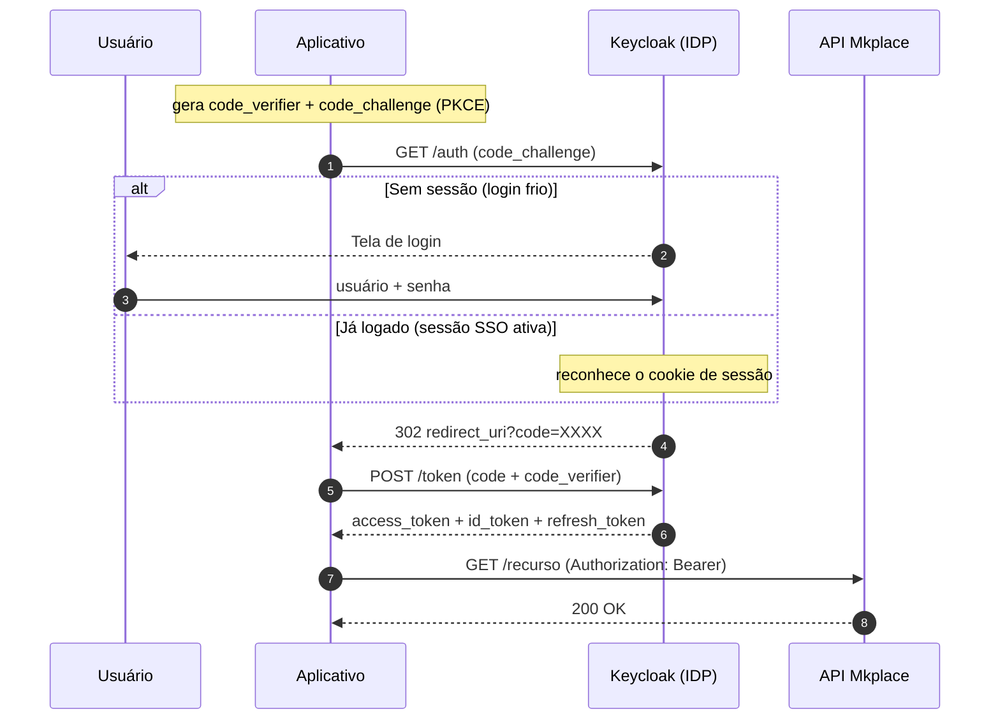

Anexo à integração de Lojas. Esta página descreve o login **de usuário** no
navegador usando OpenID Connect (OIDC) com o fluxo **Authorization Code + PKCE**
contra o Keycloak da Mkplace. É uma alternativa ao modelo de
[autenticação por JWT auto-assinado + Webview](/stores/autenticacao): aqui, quem
coleta a senha e identifica o usuário é o próprio **Keycloak**, e seu aplicativo
nunca vê a senha — recebe apenas **tokens**.

<Note>
**TL;DR — em 5 frases**

1. **OIDC** deixa o usuário logar no **Keycloak** (nosso IDP); o aplicativo recebe **tokens**, nunca a senha.
2. O fluxo **Authorization Code + PKCE** envia o usuário ao Keycloak, recebe um `code` de uso único e o troca por **`access_token` + `id_token` + `refresh_token`**.
3. **PKCE** é a trava: o app guarda um segredo (`code_verifier`) e só ele consegue trocar o `code` por token.
4. Se o usuário **já tem sessão** (cookie de SSO), a mesma requisição volta com `code` **sem mostrar tela** — isso é **Single Sign-On**.
5. `prompt=none` faz a checagem **silenciosa**: com sessão → `code`; sem sessão → `login_required`.
</Note>

## Quando usar cada modelo

| Cenário | Mecanismo | Página |
|---|---|---|
| Sua aplicação abre a Webview com um token que ela mesma assina | JWT RS256 auto-assinado | [Autenticação](/stores/autenticacao) |
| O usuário faz login interativo no navegador, pelo IDP | **OIDC Authorization Code + PKCE** | *esta página* |

## O fluxo, em um diagrama



## Pré-requisitos

- Um **client público** com **Standard Flow** habilitado e **PKCE `S256`** exigido,
  além dos **redirect URIs** do seu aplicativo. Solicite ao administrador do
  marketplace pelo canal de suporte ([suporte@mkplace.com.br](mailto:suporte@mkplace.com.br)).
- O `realm` e o `client_id` são fornecidos pela Mkplace.

<Tip>
Os endpoints reais do seu realm estão sempre em
`https://idp.mkplace.com.br/realms/{realm}/.well-known/openid-configuration`.
</Tip>

## Passo a passo

<Steps>
  <Step title="Gerar o par PKCE">
    O aplicativo sorteia um segredo (`code_verifier`) e calcula o `code_challenge`
    = base64url( SHA-256( `code_verifier` ) ). Só o *challenge* vai na ida.

    ```bash
    code_verifier=$(openssl rand -base64 96 | tr -d '\n\r' | tr '+/' '-_' | tr -d '=' | cut -c1-64)
    code_challenge=$(printf '%s' "$code_verifier" | openssl dgst -sha256 -binary \
      | openssl base64 -A | tr '+/' '-_' | tr -d '=\r\n')
    ```

    <Warning>
    O `-A` no `openssl base64` e o `tr -d '\r'` são essenciais no Windows/Git Bash:
    sem eles sobra um `\r` no fim e o `code_challenge` fica inválido
    (`Invalid parameter: code_challenge`). O challenge correto tem **43 caracteres**.
    </Warning>
  </Step>

  <Step title="Enviar o usuário ao Keycloak (requisição de autorização)">
    O aplicativo monta a URL e redireciona o navegador do usuário para ela. O
    comportamento muda conforme o usuário já tenha (ou não) uma sessão:

    <Tabs>
      <Tab title="Primeiro acesso (login frio)">
        Sem sessão → o Keycloak mostra a **tela de login**. Após o login, redireciona
        de volta com o `code`.

        ```
        GET https://idp.mkplace.com.br/realms/{realm}/protocol/openid-connect/auth
          ?client_id=<seu_client_id>
          &response_type=code
          &scope=openid%20profile%20email
          &redirect_uri=https%3A%2F%2Fseu-app.com.br%2Fcallback
          &state=<aleatório>
          &nonce=<aleatório>
          &code_challenge=<code_challenge>
          &code_challenge_method=S256
        ```

        Resposta após o login:

        ```
        HTTP/1.1 302 Found
        Location: https://seu-app.com.br/callback?state=...&code=XXXX
        ```
      </Tab>
      <Tab title="Já logado (SSO)">
        Com sessão ativa (cookie de SSO), a **mesma** requisição (sem `prompt`)
        retorna o `code` **direto, sem tela**:

        ```
        HTTP/1.1 302 Found
        Location: https://seu-app.com.br/callback?state=...&code=XXXX
        ```

        O usuário é redirecionado **já logado**. É o Single Sign-On em ação.
      </Tab>
      <Tab title="Checagem silenciosa (prompt=none)">
        Adicionando `prompt=none`, o Keycloak **nunca** mostra tela:

        - **Com** sessão → `302` com `code` (silencioso).
        - **Sem** sessão → `302` com `error=login_required`.

        ```
        HTTP/1.1 302 Found
        Location: https://seu-app.com.br/callback?error=login_required&state=...
        ```

        Usado por aplicativos de página única (SPA) num `<iframe>` escondido para
        checar a sessão sem interromper a navegação.

        <Warning>
        **Cookie de terceiro** (*third-party cookie*): dentro de um `<iframe>`, o
        navegador pode bloquear o cookie do Keycloak. Use o modo **silent check-sso**
        do adaptador JavaScript do Keycloak para contornar.
        </Warning>
      </Tab>
    </Tabs>

    | `prompt` | Com sessão | Sem sessão |
    |---|---|---|
    | *(ausente)* | reaproveita a sessão (`code`) | mostra login |
    | `none` | `code` silencioso | `error=login_required` |
    | `login` | força nova autenticação | mostra login |
  </Step>

  <Step title="Trocar o code por tokens">
    O aplicativo envia o `code` **mais** o `code_verifier` secreto. O Keycloak
    confere o PKCE e devolve os três tokens.

    <CodeGroup>
    ```bash curl
    curl --request POST \
      --url https://idp.mkplace.com.br/realms/{realm}/protocol/openid-connect/token \
      --header 'Content-Type: application/x-www-form-urlencoded' \
      --data grant_type=authorization_code \
      --data client_id=<seu_client_id> \
      --data code=<code_do_redirect> \
      --data redirect_uri=https://seu-app.com.br/callback \
      --data code_verifier=<code_verifier>
    ```
    </CodeGroup>

    ```json Resposta
    {
      "access_token": "eyJhbGciOiJSUzI1Ni...",
      "id_token": "eyJhbGciOiJSUzI1Ni...",
      "refresh_token": "eyJhbGciOiJIUzUxMi...",
      "token_type": "Bearer",
      "expires_in": 300,
      "refresh_expires_in": 1800,
      "scope": "openid profile email"
    }
    ```
  </Step>

  <Step title="Usar e renovar">
    - **Chamar a API:** envie o `access_token` no header `Authorization: Bearer`.
    - **Quem é o usuário:** `GET /protocol/openid-connect/userinfo` com o `Bearer`,
      ou leia os claims do `id_token`.
    - **Renovar:** `POST /token` com `grant_type=refresh_token`.
    - **Sair:** `POST /protocol/openid-connect/logout` com o `refresh_token`.
  </Step>
</Steps>

## Os três tokens

<AccordionGroup>
  <Accordion title="access_token — autoriza chamadas à API">
    JWT assinado em `RS256`. Vai no header `Authorization: Bearer` de toda
    requisição protegida. Traz as permissões do usuário (`realm_access.roles`).
  </Accordion>
  <Accordion title="id_token — diz quem é o usuário">
    JWT com os claims de identidade (`sub`, `email`, `preferred_username`,
    `name`, `nonce`). É para o **aplicativo**, não para a API. Para *ler* não
    precisa de chave (é base64); para *validar* a assinatura, use a chave pública
    em `/protocol/openid-connect/certs` (resolvida pelo `kid` do header).
  </Accordion>
  <Accordion title="refresh_token — renova sem novo login">
    Troca por um `access_token` novo enquanto a sessão durar
    (`refresh_expires_in`). O `logout` o invalida.
  </Accordion>
</AccordionGroup>

## Formato padrão do token

Após o login, o usuário recebe um `access_token` (JWT assinado em `RS256` pelo
Keycloak) com a estrutura abaixo. Os valores entre `<...>` variam por loja/usuário.

```json
{
  "iss": "https://idp.mkplace.com.br/realms/<realm>",
  "azp": "front-store",
  "typ": "Bearer",
  "sub": "<id do usuário no Keycloak>",
  "sid": "<id da sessão>",
  "clientId": "customer-services",
  "scope": "profile email",
  "realm_access": {
    "roles": [
      "profile:roles=STORE",
      "profile:accountId=<accountId>",
      "profile:storeId=<storeId>",
      "profile:clientId=<clientId>"
    ]
  },
  "customerId": "<customerId>",
  "storeId": "<storeId>",
  "salesman": "<salesman>",
  "preferred_username": "<email do usuário>",
  "email": "<email do usuário>"
}
```

| Claim | O que é | Origem |
|---|---|---|
| `iss` | Emissor — Keycloak da Mkplace, no realm da sua loja | Mkplace |
| `azp` | Client que emitiu o token (storefront) → `front-store` | Mkplace |
| `sub` / `sid` | ID do usuário e da sessão no Keycloak | Mkplace |
| `clientId` | Serviço de origem → `customer-services` | Mkplace |
| `customerId` | ID do comprador | **Você (loja) fornece** |
| `storeId` | ID da loja | **Você fornece** |
| `salesman` | Vendedor associado | **Você fornece** |
| `profile:roles=STORE` | Perfil do usuário (tipo STORE) | Provisionamento Mkplace |
| `profile:accountId=…` | Conta — derivado do `accountId` | **Você fornece** |
| `profile:storeId=…` | Loja — derivado do `storeId` | **Você fornece** |
| `profile:clientId=…` | Integração — derivado do `clientId` | **Você fornece** |
| `preferred_username` / `email` | Dados cadastrais do usuário | Você fornece |

### O que você precisa garantir do lado da loja

- Fornecer os identificadores do usuário: `customerId`, `storeId`, `salesman`,
  `accountId`, `clientId`.
- Garantir que o usuário exista no IDP com esses **atributos** e a **role `STORE`** —
  é isso que faz os claims acima aparecerem no token.

## Erros comuns

<AccordionGroup>
  <Accordion title="Invalid parameter: code_challenge">
    `code_challenge` malformado (ex.: `\r` no fim no Windows → 44 caracteres).
    Gere com `openssl base64 -A` + `tr -d '=\r\n'` e confirme **43 caracteres**.
  </Accordion>
  <Accordion title="invalid_grant / Code not valid">
    O `code` já foi usado, expirou, ou o `code_verifier` não corresponde ao
    `code_challenge`. Refaça o fluxo garantindo que verifier e challenge são do
    **mesmo** par.
  </Accordion>
  <Accordion title="error=login_required">
    Esperado quando `prompt=none` é usado **sem** sessão ativa. Redirecione o
    usuário para o login (sem `prompt=none`).
  </Accordion>
  <Accordion title="invalid_redirect_uri">
    O `redirect_uri` não está cadastrado no client. Solicite o cadastro do
    redirect exato ao administrador.
  </Accordion>
</AccordionGroup>

<Tip>
Quer ver o token por dentro? Cole-o em [jwt.io](https://jwt.io) para inspecionar
header e claims (não cole tokens de produção em ferramentas externas).
</Tip>
