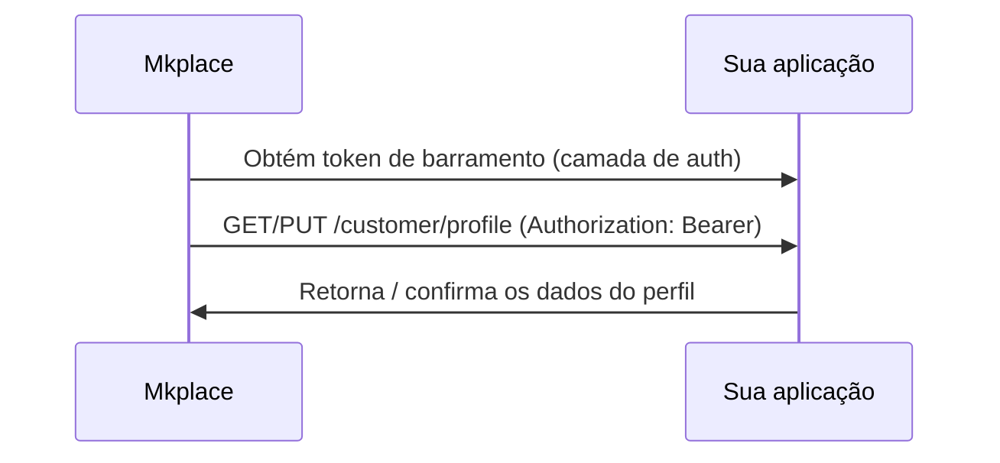

Quando os dados cadastrais (**Customer Profile**) permanecem sob a custódia do parceiro, a sua aplicação precisa **expor** os endpoints que atendem aos contratos da Mkplace para consulta e atualização do perfil. O ecossistema Mkplace os aciona usando o token autenticado.

<Info>
  Esses endpoints são implementados **pela sua aplicação**, seguindo estritamente o contrato da Mkplace. O `customerId` (claim `sub`) é a chave que identifica o usuário a ser consultado ou atualizado.
</Info>

## Resolução de perfil

Antes de acionar os gatilhos de consulta (`getCustomerProfile`) ou atualização (`updateCustomerProfile`), o backend da Mkplace obtém o token de barramento junto à camada de autenticação do parceiro e realiza a chamada segura com a credencial apropriada.



## Obtenção do perfil

Utilizado pelo ecossistema para buscar as informações atuais do usuário autenticado.

```http
GET /customer/profile
Authorization: Bearer <token>
```

## Atualização do perfil

Acionado sempre que houver alteração dos dados do cliente no ecossistema. Os novos dados são enviados no corpo da requisição, conforme o contrato.

```http
PUT /customer/profile
Authorization: Bearer <token>
```

```json
{
  "name": "Nome Atualizado do Cliente",
  "email": "novo_email@example.com"
}
```

<Note>
  O corpo acima é ilustrativo. Os campos completos e obrigatórios seguem a especificação do contrato — consulte a **Referência da API — Perfil** desta seção para o schema definitivo.
</Note>
