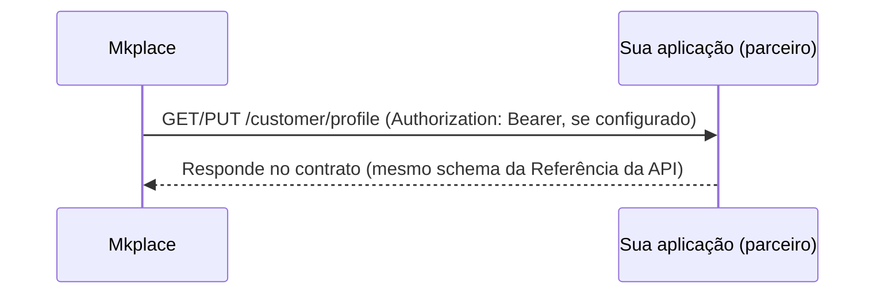

Quando os dados cadastrais (**Customer Profile**) permanecem sob a custódia do parceiro, a sua aplicação precisa **expor** os endpoints que atendem aos contratos da Mkplace para consulta e atualização do perfil. O ecossistema Mkplace os aciona usando o token autenticado.

<Info>
  Esses endpoints são implementados **pela sua aplicação**, seguindo estritamente o contrato da Mkplace. O `customerId` (claim `sub`) é a chave que identifica o usuário a ser consultado ou atualizado.
</Info>

## Como a Mkplace busca o perfil

Quando a base de clientes permanece sob a custódia do parceiro, a Mkplace **não armazena** o perfil — ela o busca **diretamente na sua aplicação, de forma semelhante a um webhook**. Para cada loja, a Mkplace mantém uma configuração com o **endpoint**, o **método HTTP** e os **headers** que a sua aplicação expõe; ao precisar do perfil, a Mkplace chama esse endpoint e espera a resposta **no contrato especificado**.

Não há etapa intermediária de troca de credenciais nem "camada de autenticação" própria: a chamada é direta. Quando a configuração assim define, o token recebido na requisição original é **repassado** no header `Authorization` para a sua aplicação validar.



## Obtenção do perfil

Utilizado pelo ecossistema para buscar as informações atuais do usuário autenticado.

```http
GET /customer/profile
Authorization: Bearer <token>
```

Contrato completo (parâmetros e schema da resposta): [Obter perfil do cliente](/api-reference/lojas-perfil/obter-perfil-do-cliente).

## Atualização do perfil

Acionado sempre que houver alteração dos dados do cliente no ecossistema. Os novos dados são enviados no corpo da requisição, conforme o contrato.

```http
PUT /customer/profile
Authorization: Bearer <token>
```

```json
{
  "name": "Nome Atualizado do Cliente",
  "email": "novo_email@example.com"
}
```

<Note>
  O corpo acima é ilustrativo. Os campos completos e obrigatórios seguem a especificação do contrato — veja [Atualizar perfil do cliente](/api-reference/lojas-perfil/atualizar-perfil-do-cliente) para o schema definitivo.
</Note>
